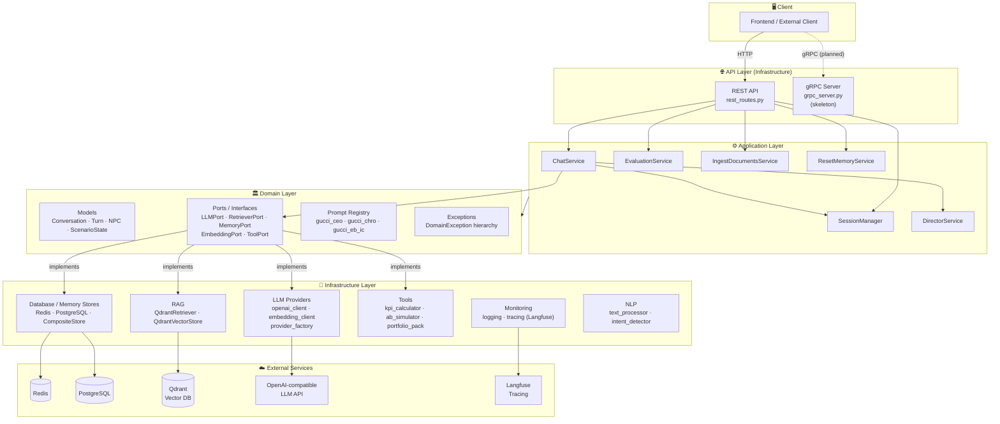

# Diagram 01 – High-Level Architecture

> **Source**: `docs/BACKEND_DOCS_V2/01_Overview.md`, `docs/BACKEND_DOCS_V2/04_Infrastructure_Layer.md`

```mermaid
flowchart TB
    subgraph CLIENT["🖥️ Client"]
        FE["Frontend / External Client"]
    end

    subgraph API["🌐 API Layer (Infrastructure)"]
        REST["REST API\nrest_routes.py"]
        GRPC_SRV["gRPC Server\ngrpc_server.py\n(skeleton)"]
    end

    subgraph APP["⚙️ Application Layer"]
        CHAT["ChatService"]
        SESSION["SessionManager"]
        DIRECTOR["DirectorService"]
        EVAL["EvaluationService"]
        INGEST["IngestDocumentsService"]
        RESET["ResetMemoryService"]
    end

    subgraph DOMAIN["🏛️ Domain Layer"]
        MODELS["Models\nConversation · Turn · NPC · ScenarioState"]
        PORTS["Ports / Interfaces\nLLMPort · RetrieverPort · MemoryPort\nEmbeddingPort · ToolPort"]
        PROMPTS["Prompt Registry\ngucci_ceo · gucci_chro · gucci_eb_ic"]
        EX["Exceptions\nDomainException hierarchy"]
    end

    subgraph INFRA["🔧 Infrastructure Layer"]
        LLM["LLM Providers\nopenai_client · embedding_client\nprovider_factory"]
        DB["Database / Memory Stores\nRedis · PostgreSQL · CompositeStore"]
        RAG_INFRA["RAG\nQdrantRetriever · QdrantVectorStore"]
        TOOLS["Tools\nkpi_calculator · ab_simulator · portfolio_pack"]
        MONITORING["Monitoring\nlogging · tracing (Langfuse)"]
        NLP["NLP\ntext_processor · intent_detector"]
    end

    subgraph EXTERNAL["☁️ External Services"]
        REDIS[("Redis")]
        PG[("PostgreSQL")]
        QDRANT[("Qdrant\nVector DB")]
        LLM_API["OpenAI-compatible\nLLM API"]
        LANGFUSE["Langfuse\nTracing"]
    end

    FE -->|"HTTP"| REST
    FE -.->|"gRPC (planned)"| GRPC_SRV

    REST --> CHAT
    REST --> SESSION
    REST --> EVAL
    REST --> INGEST
    REST --> RESET

    CHAT --> SESSION
    CHAT --> DIRECTOR
    CHAT --> PORTS

    APP --> DOMAIN

    PORTS -->|"implements"| LLM
    PORTS -->|"implements"| DB
    PORTS -->|"implements"| RAG_INFRA
    PORTS -->|"implements"| TOOLS

    LLM --> LLM_API
    DB --> REDIS
    DB --> PG
    RAG_INFRA --> QDRANT
    MONITORING --> LANGFUSE
```
