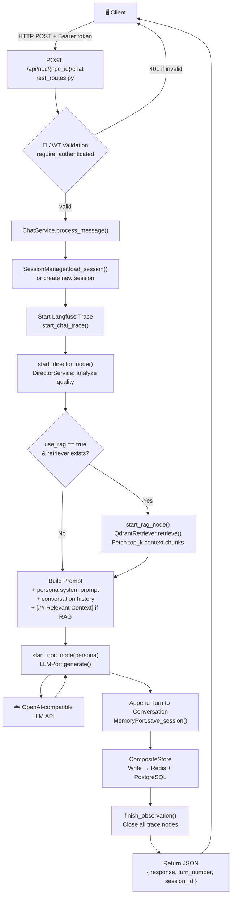

# Diagram 02 – Chat Request Flow

> **Source**: `docs/BACKEND_DOCS_V2/01_Overview.md`, `docs/BACKEND_DOCS_V2/03_Application_Layer.md`

```mermaid
flowchart TB
    CLIENT["🖥️ Client"]
    REST["POST /api/npc/{npc_id}/chat\nrest_routes.py"]
    AUTH{"🔐 JWT Validation\nrequire_authenticated"}
    CHAT["ChatService.process_message()"]
    SESSION_LOAD["SessionManager.load_session()\nor create new session"]
    TRACE["Start Langfuse Trace\nstart_chat_trace()"]
    DIRECTOR_NODE["start_director_node()\nDirectorService: analyze quality"]
    RAG_CHECK{"use_rag == true\n& retriever exists?"}
    RAG_NODE["start_rag_node()\nQdrantRetriever.retrieve()\nFetch top_k context chunks"]
    PROMPT_BUILD["Build Prompt\n+ persona system prompt\n+ conversation history\n+ [## Relevant Context] if RAG"]
    NPC_NODE["start_npc_node(persona)\nLLMPort.generate()"]
    LLM_API["☁️ OpenAI-compatible\nLLM API"]
    SAVE_TURN["Append Turn to Conversation\nMemoryPort.save_session()"]
    COMPOSITE["CompositeStore\nWrite → Redis + PostgreSQL"]
    FINISH_TRACE["finish_observation()\nClose all trace nodes"]
    RESPONSE["Return JSON\n{ response, turn_number, session_id }"]

    CLIENT -->|"HTTP POST + Bearer token"| REST
    REST --> AUTH
    AUTH -->|"401 if invalid"| CLIENT
    AUTH -->|"valid"| CHAT
    CHAT --> SESSION_LOAD
    SESSION_LOAD --> TRACE
    TRACE --> DIRECTOR_NODE
    DIRECTOR_NODE --> RAG_CHECK
    RAG_CHECK -->|"Yes"| RAG_NODE
    RAG_CHECK -->|"No"| PROMPT_BUILD
    RAG_NODE --> PROMPT_BUILD
    PROMPT_BUILD --> NPC_NODE
    NPC_NODE --> LLM_API
    LLM_API --> NPC_NODE
    NPC_NODE --> SAVE_TURN
    SAVE_TURN --> COMPOSITE
    COMPOSITE --> FINISH_TRACE
    FINISH_TRACE --> RESPONSE
    RESPONSE --> CLIENT
```
