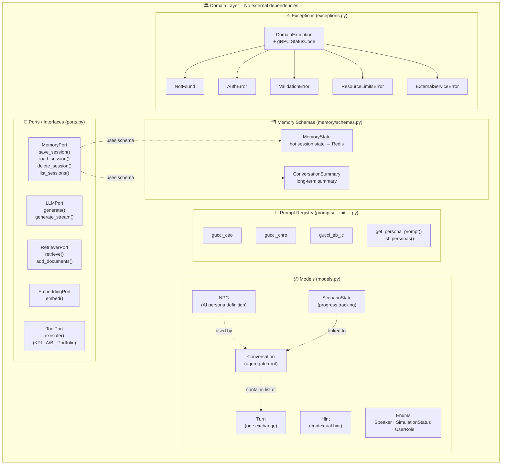

# Diagram 03 – Domain Layer

> **Source**: `docs/BACKEND_DOCS_V2/02_Domain_Layer.md`

```mermaid
flowchart TB
    subgraph DOMAIN["🏛️ Domain Layer – No external dependencies"]
        subgraph MODELS["📦 Models  (models.py)"]
            CONV["Conversation\n(aggregate root)"]
            TURN["Turn\n(one exchange)"]
            NPC_M["NPC\n(AI persona definition)"]
            SCENARIO["ScenarioState\n(progress tracking)"]
            HINT["Hint\n(contextual hint)"]
            ENUMS["Enums\nSpeaker · SimulationStatus · UserRole"]

            CONV -->|"contains list of"| TURN
            NPC_M -.->|"used by"| CONV
            SCENARIO -.->|"linked to"| CONV
        end

        subgraph PORTS["🔌 Ports / Interfaces  (ports.py)"]
            LLM_PORT["LLMPort\ngenerate()\ngenerate_stream()"]
            RETRIEVER_PORT["RetrieverPort\nretrieve()\nadd_documents()"]
            EMBED_PORT["EmbeddingPort\nembed()"]
            TOOL_PORT["ToolPort\nexecute()\n(KPI · A/B · Portfolio)"]
            MEM_PORT["MemoryPort\nsave_session()\nload_session()\ndelete_session()\nlist_sessions()"]
        end

        subgraph MEMORY_SCHEMA["🗂️ Memory Schemas  (memory/schemas.py)"]
            MEM_STATE["MemoryState\nhot session state → Redis"]
            CONV_SUMMARY["ConversationSummary\nlong-term summary"]
        end

        subgraph PROMPTS_REG["📝 Prompt Registry  (prompts/__init__.py)"]
            P1["gucci_ceo"]
            P2["gucci_chro"]
            P3["gucci_eb_ic"]
            GET_PERSONA["get_persona_prompt()\nlist_personas()"]
        end

        subgraph EXCEPTIONS["⚠️ Exceptions  (exceptions.py)"]
            BASE_EX["DomainException\n+ gRPC StatusCode"]
            NOT_FOUND["NotFound"]
            AUTH_EX["AuthError"]
            VALID_EX["ValidationError"]
            RESOURCE["ResourceLimitsError"]
            EXT_SVC["ExternalServiceError"]

            BASE_EX --> NOT_FOUND
            BASE_EX --> AUTH_EX
            BASE_EX --> VALID_EX
            BASE_EX --> RESOURCE
            BASE_EX --> EXT_SVC
        end
    end

    MEM_PORT -.->|"uses schema"| MEM_STATE
    MEM_PORT -.->|"uses schema"| CONV_SUMMARY
```
