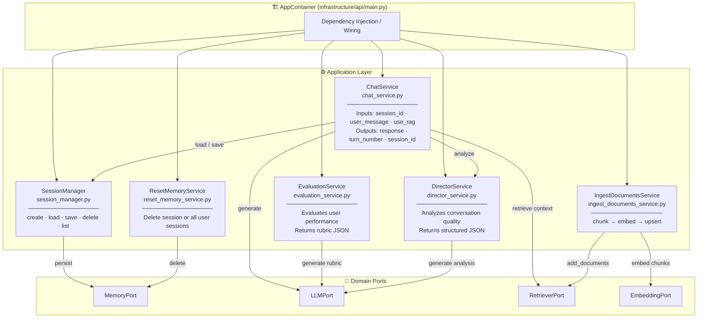

# Diagram 04 – Application Layer Services

> **Source**: `docs/BACKEND_DOCS_V2/03_Application_Layer.md`

```mermaid
flowchart TB
    subgraph CONTAINER["🏗️ AppContainer  (infrastructure/api/main.py)"]
        WIRING["Dependency Injection / Wiring"]
    end

    subgraph APP["⚙️ Application Layer"]
        CHAT_SVC["ChatService\nchat_service.py\n─────────────────\nInputs: session_id · user_message · use_rag\nOutputs: response · turn_number · session_id"]
        SESSION_MGR["SessionManager\nsession_manager.py\n─────────────────\ncreate · load · save · delete · list"]
        DIRECTOR_SVC["DirectorService\ndirector_service.py\n─────────────────\nAnalyzes conversation quality\nReturns structured JSON"]
        EVAL_SVC["EvaluationService\nevaluation_service.py\n─────────────────\nEvaluates user performance\nReturns rubric JSON"]
        INGEST_SVC["IngestDocumentsService\ningest_documents_service.py\n─────────────────\nchunk → embed → upsert"]
        RESET_SVC["ResetMemoryService\nreset_memory_service.py\n─────────────────\nDelete session or all user sessions"]
    end

    subgraph PORTS["🔌 Domain Ports"]
        MEM_PORT["MemoryPort"]
        LLM_PORT["LLMPort"]
        RETRIEVER_PORT["RetrieverPort"]
        EMBED_PORT["EmbeddingPort"]
    end

    WIRING --> CHAT_SVC
    WIRING --> SESSION_MGR
    WIRING --> DIRECTOR_SVC
    WIRING --> EVAL_SVC
    WIRING --> INGEST_SVC
    WIRING --> RESET_SVC

    CHAT_SVC -->|"load / save"| SESSION_MGR
    CHAT_SVC -->|"analyze"| DIRECTOR_SVC
    CHAT_SVC -->|"generate"| LLM_PORT
    CHAT_SVC -->|"retrieve context"| RETRIEVER_PORT

    SESSION_MGR -->|"persist"| MEM_PORT
    RESET_SVC -->|"delete"| MEM_PORT
    EVAL_SVC -->|"generate rubric"| LLM_PORT
    DIRECTOR_SVC -->|"generate analysis"| LLM_PORT
    INGEST_SVC -->|"add_documents"| RETRIEVER_PORT
    INGEST_SVC -->|"embed chunks"| EMBED_PORT
```
