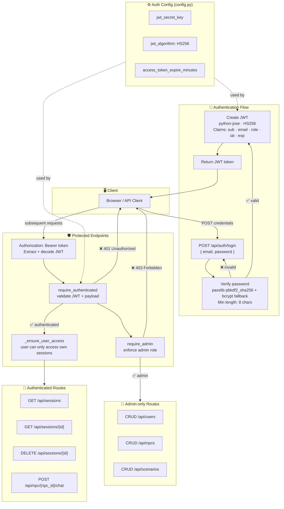

# Diagram 05 – Security & Authentication Flow

> **Source**: `docs/BACKEND_DOCS_V2/05_Security_And_Auth.md`

```mermaid
flowchart TB
    subgraph CLIENT["🖥️ Client"]
        USER_CLIENT["Browser / API Client"]
    end

    subgraph AUTH_FLOW["🔐 Authentication Flow"]
        LOGIN["POST /api/auth/login\n{ email, password }"]
        VERIFY_PW["Verify password\npasslib pbkdf2_sha256 + bcrypt fallback\nMin length: 8 chars"]
        CREATE_JWT["Create JWT\npython-jose · HS256\nClaims: sub · email · role · iat · exp"]
        JWT_RESP["Return JWT token"]
    end

    subgraph PROTECTED["🛡️ Protected Endpoints"]
        BEARER["Authorization: Bearer token\nExtract + decode JWT"]
        REQ_AUTH["require_authenticated\nvalidate JWT + payload"]
        REQ_ADMIN["require_admin\nenforce admin role"]
        ENSURE_ACCESS["_ensure_user_access\nuser can only access own sessions"]
    end

    subgraph ADMIN_ROUTES["👑 Admin-only Routes"]
        CRUD_USERS["CRUD /api/users"]
        CRUD_NPCS["CRUD /api/npcs"]
        CRUD_SCENARIOS["CRUD /api/scenarios"]
    end

    subgraph USER_ROUTES["👤 Authenticated Routes"]
        LIST_SESSION["GET /api/sessions"]
        GET_SESSION["GET /api/sessions/{id}"]
        DEL_SESSION["DELETE /api/sessions/{id}"]
        CHAT_EP["POST /api/npc/{npc_id}/chat"]
    end

    subgraph CONFIG["⚙️ Auth Config  (config.py)"]
        JWT_SECRET["jwt_secret_key"]
        JWT_ALG["jwt_algorithm: HS256"]
        JWT_EXP["access_token_expire_minutes"]
    end

    USER_CLIENT -->|"POST credentials"| LOGIN
    LOGIN --> VERIFY_PW
    VERIFY_PW -->|"❌ invalid"| LOGIN
    VERIFY_PW -->|"✅ valid"| CREATE_JWT
    CREATE_JWT --> JWT_RESP
    JWT_RESP --> USER_CLIENT

    USER_CLIENT -->|"subsequent requests"| BEARER
    BEARER --> REQ_AUTH
    REQ_AUTH -->|"❌ 401 Unauthorized"| USER_CLIENT
    REQ_AUTH -->|"✅ authenticated"| ENSURE_ACCESS
    ENSURE_ACCESS --> USER_ROUTES
    REQ_AUTH --> REQ_ADMIN
    REQ_ADMIN -->|"❌ 403 Forbidden"| USER_CLIENT
    REQ_ADMIN -->|"✅ admin"| ADMIN_ROUTES

    CONFIG -.->|"used by"| CREATE_JWT
    CONFIG -.->|"used by"| REQ_AUTH
```
