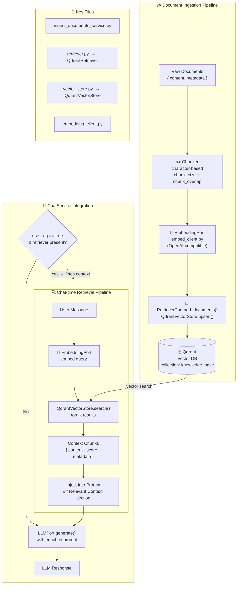

# Diagram 06 – RAG Pipeline

> **Source**: `docs/BACKEND_DOCS_V2/08_RAG_Pipeline.md`

```mermaid
flowchart TB
    subgraph INGEST["📥 Document Ingestion Pipeline"]
        direction LR
        RAW_DOCS["Raw Documents\n{ content, metadata }"]
        CHUNK["✂️ Chunker\ncharacter-based\nchunk_size + chunk_overlap"]
        EMBED_INGEST["🧮 EmbeddingPort\nembed_client.py\n(OpenAI-compatible)"]
        UPSERT["💾 RetrieverPort.add_documents()\nQdrantVectorStore.upsert()"]
        QDRANT_DB[("🗄️ Qdrant\nVector DB\ncollection: knowledge_base")]

        RAW_DOCS --> CHUNK --> EMBED_INGEST --> UPSERT --> QDRANT_DB
    end

    subgraph RETRIEVAL["🔍 Chat-time Retrieval Pipeline"]
        direction LR
        USER_Q["User Message"]
        EMBED_Q["🧮 EmbeddingPort\nembed query"]
        SEARCH["QdrantVectorStore.search()\ntop_k results"]
        RESULTS["Context Chunks\n{ content · score · metadata }"]
        PROMPT_INJ["Inject into Prompt\n## Relevant Context section"]

        USER_Q --> EMBED_Q --> SEARCH --> RESULTS --> PROMPT_INJ
    end

    subgraph CHAT_USE["💬 ChatService Integration"]
        RAG_FLAG{"use_rag == true\n& retriever present?"}
        LLM_CALL["LLMPort.generate()\nwith enriched prompt"]
        RESP["LLM Response"]

        RAG_FLAG -->|"Yes → fetch context"| RETRIEVAL
        RAG_FLAG -->|"No"| LLM_CALL
        PROMPT_INJ --> LLM_CALL
        LLM_CALL --> RESP
    end

    QDRANT_DB -->|"vector search"| SEARCH

    subgraph FILES["📁 Key Files"]
        F1["ingest_documents_service.py"]
        F2["retriever.py  →  QdrantRetriever"]
        F3["vector_store.py  →  QdrantVectorStore"]
        F4["embedding_client.py"]
    end
```
