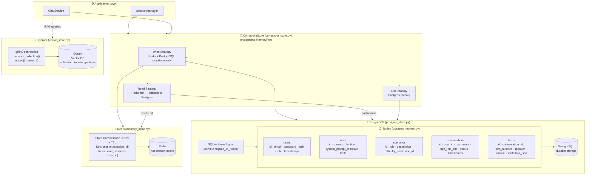

# Diagram 07 – Database & Storage Architecture

> **Source**: `docs/BACKEND_DOCS_V2/07_Database_And_Storage.md`

```mermaid
flowchart TB
    subgraph APP_LAYER["⚙️ Application Layer"]
        CHAT["ChatService"]
        SESSION["SessionManager"]
    end

    subgraph COMPOSITE["🔀 CompositeStore  (composite_store.py)\nImplements MemoryPort"]
        WRITE_STRAT["Write Strategy\nRedis + PostgreSQL simultaneously"]
        READ_STRAT["Read Strategy\nRedis first → fallback to Postgres"]
        LIST_STRAT["List Strategy\nPostgres primary"]
    end

    subgraph REDIS_STORE["⚡ Redis  (memory_store.py)"]
        REDIS_OPS["Store Conversation JSON + TTL\nKey: session:{session_id}\nIndex: user_sessions:{user_id}"]
        REDIS_DB[("Redis\nhot session cache")]
        REDIS_OPS --> REDIS_DB
    end

    subgraph PG_STORE["🐘 PostgreSQL  (postgres_store.py)"]
        PG_ORM["SQLAlchemy Async\nAlembic migrate_to_head()"]
        subgraph PG_TABLES["📋 Tables  (postgres_models.py)"]
            T_USERS["users\nid · email · password_hash · role · timestamps"]
            T_NPCS["npcs\nid · name · role_title · system_prompt_template · traits"]
            T_SCENARIOS["scenarios\nid · title · description · difficulty_level · npc_id"]
            T_CONVS["conversations\nid · user_id · npc_name · npc_role_title · status · timestamps"]
            T_TURNS["turns\nid · conversation_id · turn_number · speaker · content · metadata_json"]
        end
        PG_ORM --> PG_TABLES
        PG_DB[("PostgreSQL\ndurable storage")]
        PG_TABLES --> PG_DB
    end

    subgraph VECTOR_STORE["🔵 Qdrant  (vector_store.py)"]
        QDRANT_OPS["gRPC connection\n_ensure_collection()\nupsert() · search()"]
        QDRANT_DB[("Qdrant\nVector DB\ncollection: knowledge_base")]
        QDRANT_OPS --> QDRANT_DB
    end

    SESSION --> COMPOSITE
    CHAT --> COMPOSITE

    COMPOSITE --> WRITE_STRAT
    COMPOSITE --> READ_STRAT
    COMPOSITE --> LIST_STRAT

    WRITE_STRAT --> REDIS_STORE
    WRITE_STRAT --> PG_STORE
    READ_STRAT -->|"cache hit"| REDIS_STORE
    READ_STRAT -->|"cache miss"| PG_STORE
    LIST_STRAT --> PG_STORE

    CHAT -.->|"RAG queries"| VECTOR_STORE
```
