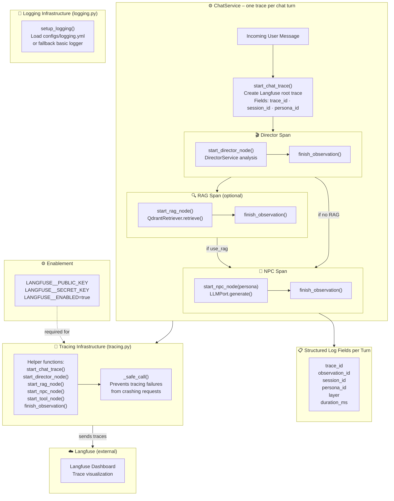

# Diagram 08 – Observability & Tracing

> **Source**: `docs/BACKEND_DOCS_V2/06_Observability_And_Tracing.md`

```mermaid
flowchart TB
    subgraph CHAT_SVC["⚙️ ChatService – one trace per chat turn"]
        MSG_IN["Incoming User Message"]
        TRACE_START["start_chat_trace()\nCreate Langfuse root trace\nFields: trace_id · session_id · persona_id"]

        subgraph SPAN_DIRECTOR["🎬 Director Span"]
            DIR_NODE["start_director_node()\nDirectorService analysis"]
            DIR_FINISH["finish_observation()"]
            DIR_NODE --> DIR_FINISH
        end

        subgraph SPAN_RAG["🔍 RAG Span (optional)"]
            RAG_NODE["start_rag_node()\nQdrantRetriever.retrieve()"]
            RAG_FINISH["finish_observation()"]
            RAG_NODE --> RAG_FINISH
        end

        subgraph SPAN_NPC["🤖 NPC Span"]
            NPC_NODE["start_npc_node(persona)\nLLMPort.generate()"]
            NPC_FINISH["finish_observation()"]
            NPC_NODE --> NPC_FINISH
        end

        MSG_IN --> TRACE_START
        TRACE_START --> SPAN_DIRECTOR
        SPAN_DIRECTOR --> SPAN_RAG
        SPAN_RAG -->|"if use_rag"| SPAN_NPC
        SPAN_DIRECTOR -->|"if no RAG"| SPAN_NPC
    end

    subgraph LOG_FIELDS["📋 Structured Log Fields per Turn"]
        FIELDS["trace_id\nobservation_id\nsession_id\npersona_id\nlayer\nduration_ms"]
    end

    subgraph TRACING_INFRA["📡 Tracing Infrastructure  (tracing.py)"]
        HELPERS["Helper functions:\nstart_chat_trace()\nstart_director_node()\nstart_rag_node()\nstart_npc_node()\nstart_tool_node()\nfinish_observation()"]
        SAFE_CALL["_safe_call()\nPrevents tracing failures\nfrom crashing requests"]
        HELPERS --> SAFE_CALL
    end

    subgraph LOGGING_INFRA["📝 Logging Infrastructure  (logging.py)"]
        SETUP["setup_logging()\nLoad configs/logging.yml\nor fallback basic logger"]
    end

    subgraph LANGFUSE["☁️ Langfuse (external)"]
        LF_DASH["Langfuse Dashboard\nTrace visualization"]
    end

    subgraph ENABLE_CHECK["⚙️ Enablement"]
        KEYS["LANGFUSE__PUBLIC_KEY\nLANGFUSE__SECRET_KEY\nLANGFUSE__ENABLED=true"]
    end

    SPAN_NPC --> LOG_FIELDS
    TRACING_INFRA -->|"sends traces"| LANGFUSE
    KEYS -.->|"required for"| TRACING_INFRA
    CHAT_SVC --> TRACING_INFRA
```
