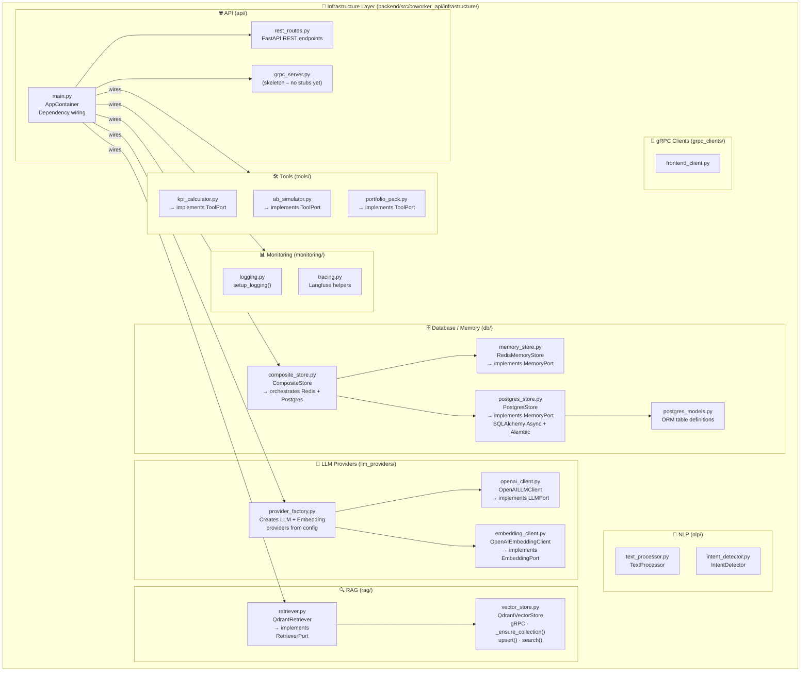

# Diagram 09 – Infrastructure Layer Detail

> **Source**: `docs/BACKEND_DOCS_V2/04_Infrastructure_Layer.md`

```mermaid
flowchart TB
    subgraph INFRA["🔧 Infrastructure Layer  (backend/src/coworker_api/infrastructure/)"]

        subgraph API_MODULE["🌐 API  (api/)"]
            MAIN["main.py\nAppContainer\nDependency wiring"]
            REST["rest_routes.py\nFastAPI REST endpoints"]
            GRPC_SRV["grpc_server.py\n(skeleton – no stubs yet)"]
            MAIN --> REST
            MAIN --> GRPC_SRV
        end

        subgraph DB_MODULE["🗄️ Database / Memory  (db/)"]
            MEM_STORE["memory_store.py\nRedisMemoryStore\n→ implements MemoryPort"]
            PG_STORE["postgres_store.py\nPostgresStore\n→ implements MemoryPort\nSQLAlchemy Async + Alembic"]
            COMP_STORE["composite_store.py\nCompositeStore\n→ orchestrates Redis + Postgres"]
            PG_MODELS["postgres_models.py\nORM table definitions"]
            COMP_STORE --> MEM_STORE
            COMP_STORE --> PG_STORE
            PG_STORE --> PG_MODELS
        end

        subgraph LLM_MODULE["🧠 LLM Providers  (llm_providers/)"]
            OPENAI_CLI["openai_client.py\nOpenAILLMClient\n→ implements LLMPort"]
            EMBED_CLI["embedding_client.py\nOpenAIEmbeddingClient\n→ implements EmbeddingPort"]
            FACTORY["provider_factory.py\nCreates LLM + Embedding\nproviders from config"]
            FACTORY --> OPENAI_CLI
            FACTORY --> EMBED_CLI
        end

        subgraph RAG_MODULE["🔍 RAG  (rag/)"]
            RETRIEVER["retriever.py\nQdrantRetriever\n→ implements RetrieverPort"]
            VECTOR_STORE["vector_store.py\nQdrantVectorStore\ngRPC · _ensure_collection()\nupsert() · search()"]
            RETRIEVER --> VECTOR_STORE
        end

        subgraph NLP_MODULE["💬 NLP  (nlp/)"]
            TEXT_PROC["text_processor.py\nTextProcessor"]
            INTENT["intent_detector.py\nIntentDetector"]
        end

        subgraph TOOLS_MODULE["🛠️ Tools  (tools/)"]
            KPI["kpi_calculator.py\n→ implements ToolPort"]
            AB["ab_simulator.py\n→ implements ToolPort"]
            PORT_PACK["portfolio_pack.py\n→ implements ToolPort"]
        end

        subgraph MON_MODULE["📊 Monitoring  (monitoring/)"]
            LOGGING["logging.py\nsetup_logging()"]
            TRACING["tracing.py\nLangfuse helpers"]
        end

        subgraph GRPC_CLI["📡 gRPC Clients  (grpc_clients/)"]
            FE_CLI["frontend_client.py"]
        end
    end

    MAIN -->|"wires"| COMP_STORE
    MAIN -->|"wires"| FACTORY
    MAIN -->|"wires"| RETRIEVER
    MAIN -->|"wires"| TOOLS_MODULE
    MAIN -->|"wires"| MON_MODULE
```
